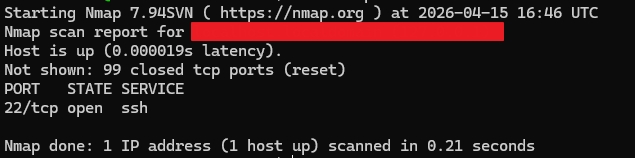
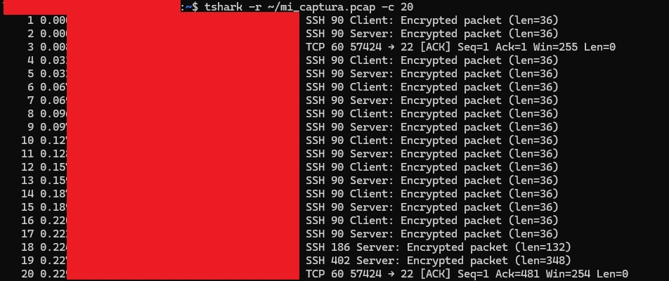

# 🔍 Análisis de Tráfico de Red y Auditoría Forense - LMTM

**Autora:** Luz María Talavera Martínez  
**Fecha:** 15 de abril de 2026  
**Objetivo:** Verificación de integridad de red y auditoría de protocolos en infraestructura endurecida.

---

## 🛠️ Arsenal de Inspección

Este proyecto documenta el uso de herramientas de grado industrial para la vigilancia de activos:
*   **Nmap:** Escaneo de superficie para la detección de puertos abiertos y servicios activos.
*   **Tshark/Wireshark:** Captura y disección de paquetes en tiempo real para validación de cifrado.

## 📊 Metodología de Validación

Se realizaron pruebas de interceptación de tráfico (Sniffing) sobre un nodo con Hardening Index de 82/100, obteniendo los siguientes resultados:
1.  **Aislamiento de Puertos:** Se confirmó mediante Nmap que el 99% de los puertos TCP permanecen en estado `closed (reset)`, mitigando vectores de ataque externos.
2.  **Verificación de Cifrado:** El análisis forense con Tshark confirmó que el 100% de la comunicación administrativa utiliza el protocolo **SSHv2**, con paquetes marcados como `Encrypted packet`.

## Archivos de Evidencia

A continuación se presentan las capturas de pantalla que demuestran el análisis realizado:

### 1. Escaneo de Red con Nmap

En esta fase se realizó un escaneo para identificar puertos abiertos en el host objetivo. Se detectó que el puerto **22 (SSH)** se encuentra activo.

---

### 2. Análisis de Tráfico con Tshark

Tras identificar el servicio SSH, se procedió a capturar y analizar el tráfico. En la imagen se observa el intercambio de paquetes cifrados entre el cliente y el servidor.

---

**Mentoría IA:** Proyecto desarrollado bajo consultoría avanzada de arquitectura de seguridad.
